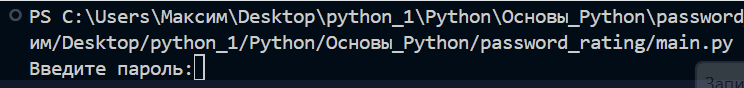

# Проект: Оценка пароля

## Описание проекта
Проверьте ваш пароль на безопасность, на основе рейтинга от 0 до 10, по следующим критериям:
- наличие цифр,
- наличие букв,
- наличие заглавных букв,
- длина (более 12),
- наличие любых символов.
За выполнение каждого критерия вам будет прибавляться 2 бала к рейтингу.

## Цели проекта
Оценить надежность и безопасность пароля пользователя.

## Используемые технологии
- `python` - для написания всего кода.

## Функции проекта
Есть основная функция проекта `main()`, Которая содержит за каждое правильное выполнения условия функций начисляет 2 бала к рейтингу вашего пароля.
- `has_digit_in_password()` - эта функция проверяет пароль на наличие цифр в нем. Если они в нем есть, то вы получите +2 бала к рейтингу.
- `get_password()` - проверяет пароль на наличие любых символов чтобы в дальнейшем вести их подсчет.
- `get_lenght()` - проверяет пароль на длину. Если их количеств больше 12, то вы получите +2 бала к рейтингу пароля.
- `has_leters_in_password()` - ищет в пароле буквенные символы. За их наличие вы также получите +2 бала.
- `has_high_leters_in_password()` - ищет в пароле именно заглавные буквы, и если они есть, то вам зачислится +2 бала
Выше перечисленные функции также используют встроенную фцнкцию `any`, которая имеет два значения `True` или `False`, возвращая их при выполнения или невыполнения элементом пароля условия данной функции.
В конце функция `main()` подведет итоги и выдвинет итоговую оценку вашего пароля от 0 до 10, соответственно это значение показывает то, насколько ваш пароль безопасен.

## Пример запуска
Для правильной работы кода на ваш компьютер должен быть установлен Python 3.11 и выше.
просто запустите данный код, и в консоли введите ваш пароль, затем ниже выведется рейтинг введенного вами пароля.

## Пример использования

### Проект выполнен в образовательных целях на онлайн-курсе "Основы Python" школы "Лидер".
